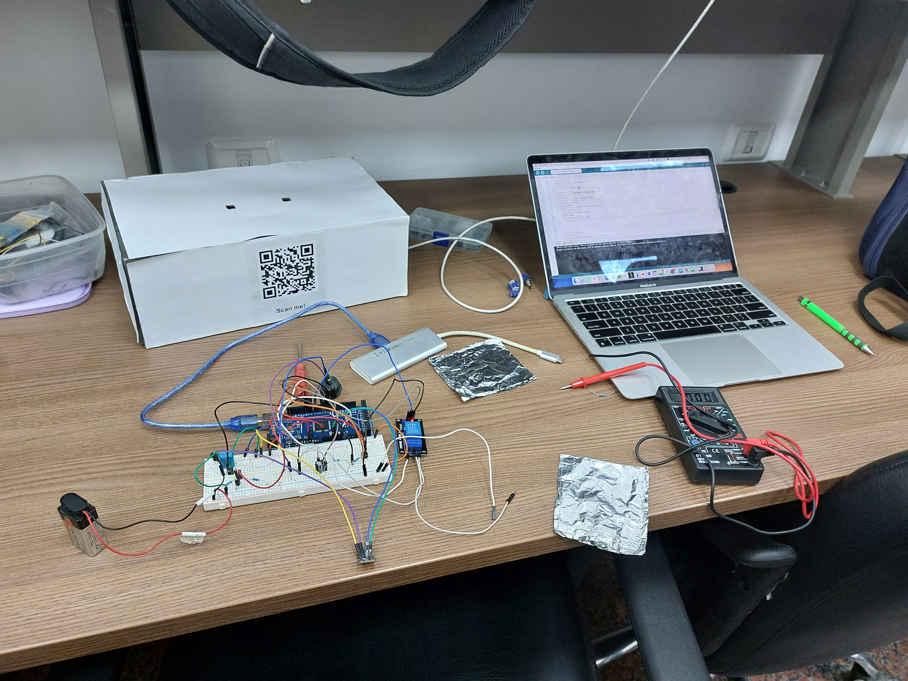

# Defibrillator with QR Code Based 3D Illustrative Guide and Email Reporting Capability

## Contents

- [Overview](#overview)
- [Key Features](#key-features)
- [3D Guide](#mobile-interface)
- [Email Report](#email-report)
- [Contributors](#contributors)

## Overview

This project utilizes Arduino to build a defibrillator system that not only administers shock but also provides vital health monitoring features. It is equipped with ECG visualization, battery testing, and energy discharge testing capabilities. The defibrillator sends reports of these tests to biomedical engineers or technicians via email, ensuring timely maintenance and monitoring.

Additionally, the device includes a QR code placed on the defibrillator unit itself, which when scanned, opens a web-based 3D animation. This animation demonstrates the procedure for delivering a shock to a person in need of emergency defibrillation, enhancing accessibility to vital life-saving information.

Data from the system is displayed on a real-time ECG interface, allowing for effective cardiac monitoring. The integration of battery and energy tests ensures that the device is always in optimal working condition, and the automatic email notification feature helps technicians monitor the device's status remotely.

  

This design shows the integration of the defibrillator unit with sensors to monitor key parameters, such as heart rate and battery health. The energy discharge test ensures that the defibrillator can deliver the required shock level to patients.

 

  

This figure demonstrates how the device performs the necessary tests and generates detailed reports, which are automatically sent to the designated recipients.

 

  

This image shows the QR code placed on the defibrillator, which when scanned, opens a web-based 3D animation guiding the user on how to administer a shock during an emergency.

 

## Key Features

- **ECG Monitoring**: Continuous monitoring of ECG signals to display real-time heart activity.
- **Battery Health Check**: Regular battery tests to ensure optimal performance.
- **Energy Discharge Test**: Verifies the defibrillator’s ability to discharge energy correctly.
- **Email Notifications**: Automatically sends test results to biomedical engineers/technicians for analysis.
- **QR Code for 3D Animation**: Provides emergency defibrillation instructions via a web-based 3D animation, accessible by scanning a QR code on the defibrillator.
  
## 3D Guide

  

[3D Guide Link](https://playcanv.as/p/33467510/)

## Email Report

  

## Contributors

- **Ibrahim Fateen**  
  [LinkedIn](https://www.linkedin.com/in/ibrahim-fateen-a93b411ab/)

- **Youssef Abo-El-Ela**  
  [LinkedIn](https://www.linkedin.com/in/youssef-abo-el-ela-a4a12b235/)

- **Ali Younis**  
  [LinkedIn](https://www.linkedin.com/in/ali-younis-98b780277/)

- **Omar Khaled**  
  [LinkedIn](https://www.linkedin.com/in/omar-khaled-064b7930a/)
